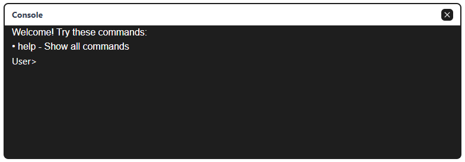

<p align="center">
  
</p>

# S-Console


<p align="center">
  <strong>A lightweight, customizable JavaScript console library for web applications</strong>
</p>

<p align="center">
  <a href="https://github.com/gusdeyw/s-console/actions/workflows/build-library.yml">
    
  </a>
  <a href="https://github.com/gusdeyw/s-console/releases">
    
  </a>
  <a href="https://github.com/gusdeyw/s-console/blob/main/LICENSE">
    
  </a>
  <a href="https://cdn.jsdelivr.net/gh/gusdeyw/s-console@latest/dist/">
    
  </a>
  
  
  
</p>

<p align="center">
  <a href="https://gusdeyw.github.io/s-console/">🚀 Live Demo</a> • 
  <a href="https://github.com/gusdeyw/s-console">📦 GitHub</a> • 
  <a href="https://cdn.jsdelivr.net/gh/gusdeyw/s-console@latest/dist/">📡 CDN</a>
</p>

Built with TypeScript and styled with UnoCSS.

## Features

- 🎨 Customizable appearance (font size, font family, themes)
- ⌨️ Built-in commands (help, clear, font adjustment)
- ⚡ Keyboard shortcuts for common actions:
  - Ctrl/Cmd + L: Clear console
  - Ctrl/Cmd + K: Clear input field
  - Escape: Blur/unfocus input field
- 🔧 Easy command creation and management
- 🌐 Global window access for debugging
- 📦 Multiple build formats (ESM, CJS, UMD, IIFE)
- 🎯 TypeScript support with full type definitions

## Tech Stack

- **TypeScript** - Type-safe development
- **Vite** - Build tool and dev server
- **UnoCSS** - Utility-first CSS framework
- **HTML Templates** - Dynamic UI generation

## Installation

### CDN (Recommended)
```html
<!-- Include CSS -->
<link rel="stylesheet" href="https://cdn.jsdelivr.net/gh/gusdeyw/s-console@latest/dist/s-console.css">

<!-- Include JavaScript (choose one format) -->
<!-- ES Module -->
<script type="module">
  import sconsole from 'https://cdn.jsdelivr.net/gh/gusdeyw/s-console@latest/dist/s-console.es.js';
  const console = new sconsole('my-container');
</script>

<!-- Or UMD (for older browsers) -->
<script src="https://cdn.jsdelivr.net/gh/gusdeyw/s-console@latest/dist/s-console.umd.js"></script>
<script>
  const console = new sconsole('my-container');
</script>
```

### Build from Source
```bash
# Clone the repository
git clone https://github.com/gusdeyw/s-console.git
cd s-console

# Install dependencies
npm install

# Build the library
npm run build

# Use the files from dist/ folder
# - dist/s-console.es.js (ES Module)
# - dist/s-console.cjs.js (CommonJS)
# - dist/s-console.umd.js (UMD)
# - dist/s-console.iife.js (IIFE for browser)
# - dist/style.css (Styles)
```

### Direct Usage
```html
<!-- Copy built files to your project and include them -->
<link rel="stylesheet" href="./dist/style.css">
<script src="./dist/s-console.iife.js"></script>

<!-- Or use ES modules -->
<script type="module">
import { sconsole } from './dist/s-console.es.js';
</script>
```

## Quick Start

### 1. HTML Setup
```html
<!DOCTYPE html>
<html>
<head>
    <link rel="stylesheet" href="path/to/s-console/style.css">
</head>
<body>
    <div id="my-console"></div>
    <script src="path/to/s-console.js"></script>
</body>
</html>
```

### 2. JavaScript Initialization
```javascript
// Basic initialization
const console = new sconsole('my-console');

// With custom options
const console = new sconsole('my-console', {
    fontSize: '16px',
    fontFamily: 'Arial',
    theme: 'dark'
});
```

## API Reference

### Constructor

```typescript
new sconsole(containerId?: string, options?: Partial<ConsoleOptions>)
```

**Parameters:**
- `containerId` (optional): HTML element ID where console will be mounted
- `options` (optional): Configuration options

### ConsoleOptions Interface

```typescript
interface ConsoleOptions {
    fontSize: string;     // Default: '14px'
    fontFamily: string;   // Default: 'monospace'
    theme: string;        // Default: 'dark'
}
```

### Methods

#### `addCommand(key: string, callback: () => void)`
Add a custom command to the console.

```javascript
console.addCommand('hello', () => {
    console.appendToConsole('Hello, World!');
});
```

#### `appendToConsole(message: string)`
Add a message to the console output.

```javascript
console.appendToConsole('This is a message');
console.appendToConsole('<span style="color: red;">HTML message</span>');
```

#### `updateOptions(options: Partial<ConsoleOptions>)`
Update console options dynamically.

```javascript
console.updateOptions({
    fontSize: '18px',
    fontFamily: 'Courier New'
});
```

#### `clear()`
Clear the console output and input field.

```javascript
console.clear();
```

### Built-in Commands

The console comes with several built-in commands:

- `help` - List all available commands
- `clear` - Clear console output
- `options` - Show current configuration

## Usage Examples

### Basic Command Setup
```javascript
// Initialize console
const myConsole = new sconsole('console-container');

// Add custom commands
myConsole.addCommand('time', () => {
    myConsole.appendToConsole(new Date().toLocaleString());
});

myConsole.addCommand('random', () => {
    const num = Math.floor(Math.random() * 100);
    myConsole.appendToConsole(`Random number: ${num}`);
});

myConsole.addCommand('info', () => {
    myConsole.appendToConsole('S-Console v1.0.0');
    myConsole.appendToConsole('Built with TypeScript and UnoCSS');
});
```

### Advanced Example with Custom Styling
```javascript
// Custom styled console
const styledConsole = new sconsole('styled-console', {
    fontSize: '16px',
    fontFamily: 'Fira Code, monospace',
    theme: 'dark'
});

// Add command with formatted output
styledConsole.addCommand('status', () => {
    styledConsole.appendToConsole('<span style="color: green;">✓ System Online</span>');
    styledConsole.appendToConsole('<span style="color: blue;">ℹ Memory Usage: 45%</span>');
    styledConsole.appendToConsole('<span style="color: orange;">⚠ 3 Warnings</span>');
});

// Dynamic font adjustment
styledConsole.addCommand('bigtext', () => {
    styledConsole.updateOptions({ fontSize: '20px' });
});
```

### Integration with Existing Applications
```javascript
// Global access for debugging
window.debugConsole = new sconsole('debug-panel');

// Add application-specific commands
debugConsole.addCommand('reset', () => {
    // Your app reset logic
    localStorage.clear();
    debugConsole.appendToConsole('Application reset complete');
});

debugConsole.addCommand('version', () => {
    debugConsole.appendToConsole(`App Version: ${APP_VERSION}`);
});
```

## TypeScript Support

S-Console is built with TypeScript and provides full type definitions:

```typescript
import { sconsole } from 's-console';
import type { ConsoleOptions } from 's-console/types';

const options: ConsoleOptions = {
    fontSize: '14px',
    fontFamily: 'monospace',
    theme: 'dark'
};

const typedConsole = new sconsole('container', options);
```

## Development

```bash
# Install dependencies
npm install

# Start development server
npm run dev

# Build library
npm run build
```

## TODO - Roadmap & Improvements

### 🚀 Core Functionality Enhancements
- [ ] **Command Arguments Support** - Allow commands to accept parameters (e.g., `echo hello world`)
- [ ] **Command History** - Add up/down arrow navigation through previous commands
- [ ] **Tab Completion** - Auto-complete commands and provide suggestions
- [ ] **Multi-line Command Support** - Allow commands that span multiple lines
- [ ] **Command Aliases** - Support for creating command shortcuts/aliases
- [ ] **Command Groups/Namespaces** - Organize commands into categories (e.g., `file.list`, `system.info`)
- [ ] **Async Command Support** - Better handling for commands that return promises
- [ ] **Command Validation** - Add input validation and error handling for commands

### 🎨 UI/UX Improvements
- [ ] **Theme System** - Implement proper light/dark theme switching with CSS custom properties
- [ ] **Resizable Console** - Allow users to resize the console window
- [ ] **Draggable Console** - Make the console window draggable
- [ ] **Minimize/Maximize** - Add minimize and maximize functionality
- [ ] **Custom CSS Classes** - Allow custom styling through configuration
- [ ] **Animation Effects** - Add smooth transitions and typing animations
- [ ] **Console Positioning** - Support different positioning (top, bottom, floating)
- [ ] **Responsive Design** - Better mobile and tablet support

### 📊 Advanced Features
- [ ] **Command Output Formatting** - Support for tables, progress bars, and structured data
- [ ] **File Operations** - Built-in commands for file system operations (where applicable)
- [ ] **Console Logs Integration** - Capture and display console.log, console.error, etc.
- [ ] **Export/Import** - Save and load console history and commands
- [ ] **Plugin System** - Architecture for extending console with plugins
- [ ] **Scripting Support** - Execute multiple commands in sequence
- [ ] **Variable Storage** - Store and retrieve variables within console session
- [ ] **Network Commands** - Built-in fetch/HTTP request capabilities

### 🔧 Developer Experience
- [ ] **Better TypeScript Types** - More comprehensive type definitions and generics
- [ ] **Event System** - Emit events for command execution, console state changes
- [ ] **API Improvements** - More intuitive method names and parameter handling
- [ ] **Error Handling** - Comprehensive error handling and user feedback
- [ ] **Debug Mode** - Enhanced debugging capabilities and verbose logging
- [ ] **Command Documentation** - Auto-generated help text for commands
- [ ] **Configuration Schema** - JSON schema for configuration validation

### 📦 Build & Distribution
- [ ] **NPM Package** - Publish to npm registry for easier installation
- [ ] **Bundle Size Optimization** - Reduce library size and improve tree-shaking
- [ ] **CSS-in-JS Option** - Eliminate need for separate CSS file
- [ ] **Framework Integrations** - React, Vue, Angular wrapper components
- [ ] **CDN Optimization** - Better CDN delivery and version management

### 🧪 Testing & Quality
- [ ] **Unit Tests** - Comprehensive test coverage with Jest/Vitest
- [ ] **E2E Tests** - End-to-end testing with Playwright or Cypress
- [ ] **Visual Regression Tests** - Ensure UI consistency across changes
- [ ] **Performance Tests** - Benchmark console performance with large outputs
- [ ] **Browser Compatibility Tests** - Automated testing across browsers
- [ ] **Accessibility Testing** - WCAG compliance and screen reader support

### 📝 Documentation & Examples
- [ ] **Interactive Documentation** - Live examples and playground
- [ ] **Video Tutorials** - Screen recordings showing features
- [ ] **Migration Guide** - Guide for upgrading between versions
- [ ] **Cookbook** - Common use cases and recipes
- [ ] **API Reference** - Complete method and property documentation
- [ ] **Contribution Guide** - Detailed guide for contributors

### 🔒 Security & Performance
- [ ] **XSS Prevention** - Sanitize HTML input and output
- [ ] **Memory Management** - Limit console history to prevent memory leaks
- [ ] **Performance Optimization** - Virtualized rendering for large outputs
- [ ] **Input Sanitization** - Validate and sanitize user input
- [ ] **CSP Compliance** - Content Security Policy compatibility

### 🌟 Nice-to-Have Features
- [ ] **Syntax Highlighting** - Color coding for different command types
- [ ] **Command Templates** - Pre-built command templates for common tasks
- [ ] **Keyboard Shortcuts** - Customizable keyboard shortcuts
- [ ] **Multi-Console Support** - Multiple console instances on same page
- [ ] **Console Sharing** - Share console sessions via URL or export
- [ ] **Command Scheduling** - Schedule commands to run at intervals
- [ ] **Integration APIs** - Easy integration with monitoring and logging systems

## Browser Support

- Modern browsers (Chrome, Firefox, Safari, Edge)
- ES6+ support required
- CSS Grid and Flexbox support required

## Community Contributors

S-Console is built by an amazing community of contributors who share a passion for creating great tools. Everyone contributes happily to make this project better! 🌟

### Contributors

We'd like to thank our amazing contributors! 🙏

<table>
  <tr>
    <td align="center">
      <a href="https://github.com/gusdeyw">
        
        <br />
        <sub><b>gusdeyw</b></sub>
      </a>
    </td>
    <td align="center">
      <a href="https://github.com/davidgeri">
        
        <br />
        <sub><b>davidgeri</b></sub>
      </a>
    </td>
  </tr>
</table>

### Join Our Community

We welcome contributions from everyone! Whether it's code, documentation, bug reports, or feature suggestions - every contribution makes a difference.

<a href="https://github.com/gusdeyw/s-console/graphs/contributors">
  
</a>

#### How to Contribute

Please see our [Contributing Guide](./CONTRIBUTING.md) for detailed information on how to get started with contributing to S-Console.

## License

MIT License - see LICENSE file for details.